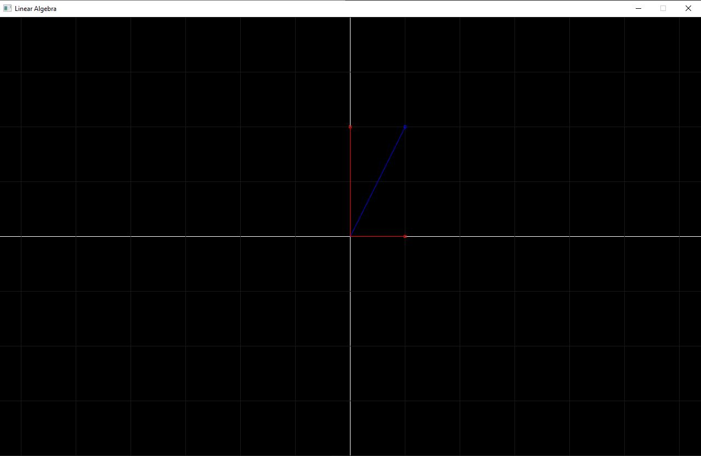
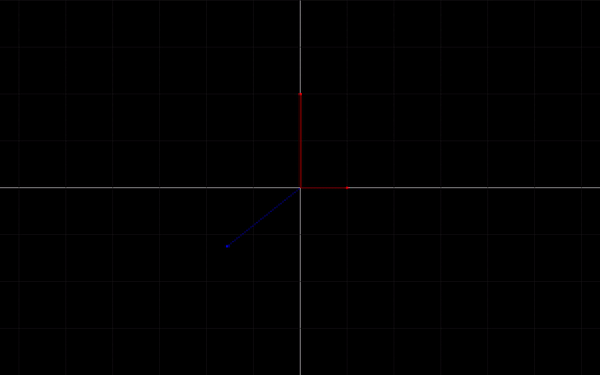

## Readme 
This is just a project for me to study simple concepts of Linear Algebra. 

For the image plotting I'm using [SDL2](https://www.libsdl.org/download-2.0.php) and for matrices manipulation I'm using [Eigen](https://eigen.tuxfamily.org/index.php?title=Main_Page).

The two operations implemented so far are `Add` two vectors and `Transform` a vector using a transformation matrix.

* Sum:

* Rotation of vertical vector

